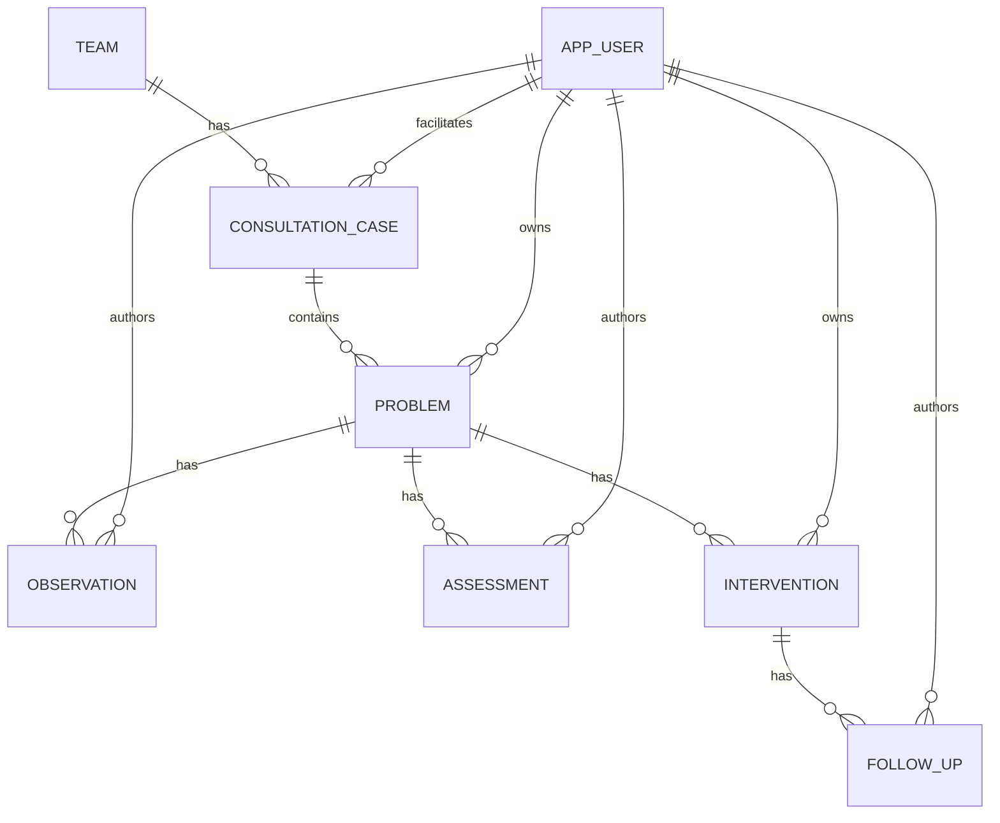

# Database Schema

This document describes the initial PostgreSQL 18 table design for consultation-record.

The executable draft DDL is in [database-schema.sql](database-schema.sql).

## Design Principles

- Keep the POS flow explicit in the relational model.
- Use stable relational constraints for core invariants.
- Store status values as short strings with `CHECK` constraints first.
- Use `bigint GENERATED BY DEFAULT AS IDENTITY` for primary keys.
- Use `timestamp with time zone` for audit timestamps.
- Prefer cascade delete only inside the case/problem record tree.
- Keep users and teams protected from accidental deletion by using `RESTRICT` or `SET NULL`.

## Tables

### `app_user`

Application users.

Named `app_user` instead of `user` because `user` is easy to confuse with SQL/session concepts.

Main columns:

- `id`
- `name`
- `email`
- `role`
- `enabled`
- `created_at`
- `updated_at`

Constraints:

- `email` is unique.
- `role` is one of `ADMIN`, `FACILITATOR`, or `REVIEWER`.

### `team`

Development teams or organizational units being analyzed.

Main columns:

- `id`
- `name`
- `description`
- `created_at`
- `updated_at`

Constraints:

- `name` is unique for the initial single-tenant design.

### `consultation_case`

A bounded analysis context for a team.

Main columns:

- `id`
- `team_id`
- `facilitator_user_id`
- `title`
- `status`
- `purpose`
- `opened_on`
- `closed_on`
- `created_at`
- `updated_at`

Constraints:

- References `team`.
- References the facilitator in `app_user`.
- `status` is one of `OPEN`, `PAUSED`, `CLOSED`, or `ARCHIVED`.
- `closed_on` must not be before `opened_on`.

Deletion rule:

- Team and facilitator deletion is restricted while cases reference them.

### `problem`

A problem-oriented record inside a consultation case.

Main columns:

- `id`
- `consultation_case_id`
- `owner_user_id`
- `title`
- `status`
- `priority`
- `statement`
- `opened_on`
- `closed_on`
- `created_at`
- `updated_at`

Constraints:

- References `consultation_case`.
- Optionally references an owner in `app_user`.
- `status` is one of `OPEN`, `MONITORING`, `RESOLVED`, `CLOSED`, or `ARCHIVED`.
- `priority` is one of `LOW`, `MEDIUM`, `HIGH`, or `CRITICAL`.
- `closed_on` must not be before `opened_on`.

Deletion rule:

- Deleting a consultation case deletes its problems.
- Deleting a user keeps the problem and clears `owner_user_id`.

### `observation`

A factual note attached to a problem.

Main columns:

- `id`
- `problem_id`
- `author_user_id`
- `content`
- `source`
- `observed_on`
- `created_at`
- `updated_at`

Deletion rule:

- Deleting a problem deletes observations.
- Deleting a user keeps the observation and clears `author_user_id`.

### `assessment`

A hypothesis or interpretation attached to a problem.

Main columns:

- `id`
- `problem_id`
- `author_user_id`
- `hypothesis`
- `confidence`
- `created_at`
- `updated_at`

Constraints:

- `confidence` is one of `LOW`, `MEDIUM`, or `HIGH`.

Deletion rule:

- Deleting a problem deletes assessments.
- Deleting a user keeps the assessment and clears `author_user_id`.

### `intervention`

An action or experiment intended to improve a problem.

Main columns:

- `id`
- `problem_id`
- `owner_user_id`
- `title`
- `plan`
- `status`
- `planned_on`
- `completed_on`
- `created_at`
- `updated_at`

Constraints:

- `status` is one of `PLANNED`, `IN_PROGRESS`, `COMPLETED`, or `CANCELED`.
- `completed_on` must not be before `planned_on` when both are present.

Deletion rule:

- Deleting a problem deletes interventions.
- Deleting a user keeps the intervention and clears `owner_user_id`.

### `follow_up`

An outcome check for an intervention.

Main columns:

- `id`
- `intervention_id`
- `author_user_id`
- `result`
- `next_action`
- `followed_up_on`
- `created_at`
- `updated_at`

Deletion rule:

- Deleting an intervention deletes follow-ups.
- Deleting a user keeps the follow-up and clears `author_user_id`.

## Relationship Summary



## Index Strategy

The initial schema indexes:

- foreign keys used in joins and detail pages
- status columns used in list filters
- date columns used in timeline-style ordering

More indexes should be added from observed query patterns rather than guessed early.

## Persistence Mapper Decision

The schema is intentionally compatible with either MyBatis or JPA.

MyBatis keeps SQL explicit and works well for custom list, timeline, and analysis queries.

JPA can also fit this model because the core relationships are conventional parent-child associations. If JPA is selected, pay attention to:

- `app_user` as the entity table name instead of `user`
- enum mapping for role, status, priority, and confidence strings
- lazy loading boundaries in Thymeleaf screens
- avoiding cascade rules in JPA that conflict with database `ON DELETE` rules
- repository queries for list pages to avoid N+1 query behavior
- migration-managed schema instead of relying on Hibernate DDL generation

## Deferred Decisions

- Whether to introduce Flyway or Liquibase for migrations.
- Whether to use MyBatis or JPA for persistence mapping.
- Whether to use PostgreSQL enum types instead of string values with `CHECK`.
- Whether to add tags/categories for problems.
- Whether to add attachment tables for observations.
- Whether tenant isolation is required.
- Whether `updated_at` should be maintained by application code or PostgreSQL triggers.

## Test Database Direction

Application and persistence tests should use Testcontainers-managed PostgreSQL 18 instead of H2. This keeps SQL syntax, constraints, identity behavior, and PostgreSQL-specific edge cases aligned with production.

Use Spring Boot's Testcontainers service connection support so tests define a PostgreSQL container once and let Spring Boot supply the JDBC connection details.

For Rancher Desktop on macOS, local test execution may need Docker socket variables, for example:

```sh
DOCKER_HOST=unix:///Users/ssobue/.rd/docker.sock \
TESTCONTAINERS_DOCKER_SOCKET_OVERRIDE=/var/run/docker.sock \
TESTCONTAINERS_RYUK_DISABLED=true \
./gradlew test
```

`TESTCONTAINERS_RYUK_DISABLED=true` is a local workaround for environments where the Ryuk sidecar cannot mount or reach the Docker socket. CI should prefer a Docker environment where Ryuk can run normally.
