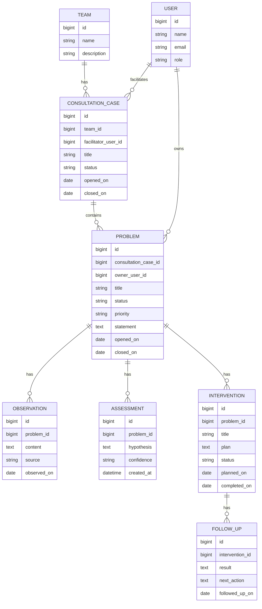

# Initial Design

## Purpose

consultation-record is a POS (problem oriented system) application for analyzing and recording organizational issues in development teams.

The application should help a facilitator, engineering manager, or team member keep a structured record of observed problems, related facts, hypotheses, interventions, and follow-up outcomes. The primary value is not only storing notes, but preserving the reasoning process behind organizational diagnosis.

## Product Principles

- Treat problems as first-class records, not as loose meeting notes.
- Separate observations, interpretations, and actions so the team can revisit assumptions.
- Keep the history of a problem visible over time.
- Prefer small, reviewable records over large free-form documents.
- Make it possible to connect multiple problems into a wider organizational picture.

## Initial Actors

- Facilitator: creates and maintains consultation records.
- Team member: provides observations, context, and feedback.
- Reviewer: reads records and checks reasoning, progress, and next actions.
- Administrator: manages users, teams, and access.

## Core Concepts

### Team

A development team or organizational unit being analyzed.

Examples:

- Product development team
- Platform team
- Engineering management group

### Consultation Case

A bounded consultation or analysis context for one team over a period of time.

A case may contain multiple problems. It represents the working file for one engagement, not a single issue.

### Problem

A problem-oriented record that captures a concern, symptom, or organizational issue.

A problem should have:

- title
- current status
- severity or priority
- problem statement
- related team
- owner or facilitator
- opened date
- closed date when resolved

### Observation

A factual note connected to a problem.

Observations should describe what was seen, heard, measured, or reported. They should avoid conclusions where possible.

### Assessment

An interpretation or hypothesis about a problem.

Assessments may change over time as new observations are added.

### Intervention

An action or experiment intended to improve the problem.

Examples:

- Change meeting structure
- Introduce explicit decision records
- Adjust on-call handoff
- Run a retrospective focused on dependency management

### Follow-up

A check after an intervention that records outcome, remaining risk, and next action.

## POS Flow

The initial application flow is:

1. Create a consultation case for a team.
2. Register one or more problems in the case.
3. Add observations to each problem.
4. Add assessments that explain possible causes.
5. Plan interventions.
6. Record follow-ups.
7. Close or archive problems when the team no longer needs active tracking.

## Initial Domain Model



## Suggested Package Structure

Use a package-by-feature style so domain language stays close to its use cases.

```text
dev.sobue.consultation
  casefile
    web
    application
    domain
    persistence
  problem
    web
    application
    domain
    persistence
  team
    web
    application
    domain
    persistence
  user
    web
    application
    domain
    persistence
  shared
    web
    security
    validation
```

Package responsibilities:

- `web`: controllers, request/response DTOs, form objects, view models
- `application`: use case services and transaction boundaries
- `domain`: domain objects, enums, policies, invariants
- `persistence`: MyBatis mappers, SQL, repository adapters
- `shared`: cross-cutting concerns that are not specific to one feature

## UI First Scope

Because Thymeleaf is already included, start with server-rendered pages for the core workflow.

Initial pages:

- Case list
- Case detail
- Problem detail
- Problem creation/edit form
- Observation add form
- Assessment add form
- Intervention add form
- Follow-up add form

REST endpoints can be added later for asynchronous interactions or external integrations. When adding REST APIs, keep request/response DTOs separate from domain and persistence models.

## Application Stack

- Spring Boot 4
- Thymeleaf server-rendered UI
- Spring Security form login
- MyBatis or JPA for relational persistence
- PostgreSQL 18 for production and local development persistence
- Testcontainers-managed PostgreSQL 18 for application and persistence tests

## Persistence Direction

Use PostgreSQL 18 as the database. The persistence mapper choice remains open between MyBatis and JPA until the first vertical slice clarifies query complexity and aggregate behavior.

The initial table design is described in [database-schema.md](database-schema.md), with draft PostgreSQL DDL in [database-schema.sql](database-schema.sql).

Shared conventions:

- database IDs as `bigint`
- timestamps using application-managed `created_at` and `updated_at`
- status and priority stored as short strings backed by Java enums
- PostgreSQL-specific behavior should be covered by tests that run against PostgreSQL through Testcontainers

Spring Boot can auto-configure a JDBC `DataSource` from `spring.datasource.*` properties. The JDBC driver class normally does not need to be configured manually because it can be inferred from the PostgreSQL JDBC URL.

Example local configuration:

```yaml
spring:
  datasource:
    url: jdbc:postgresql://localhost:5432/consultation_record
    username: consultation_record
    password: consultation_record
```

### MyBatis Option

MyBatis is a good fit if the application leans toward explicit SQL, hand-tuned list/detail queries, and report-style screens.

Use MyBatis when:

- query shape matters more than entity lifecycle
- timeline and dashboard queries need custom SQL
- updates are straightforward and use-case oriented
- the team wants SQL to stay visible in the codebase

Suggested conventions:

- one mapper interface per feature aggregate
- SQL files grouped by feature when XML mappers are introduced
- domain objects should not depend on MyBatis annotations

### JPA Option

JPA is a good fit if the application treats cases, problems, observations, assessments, interventions, and follow-ups as aggregates with lifecycle behavior.

Use JPA when:

- aggregate creation and updates dominate over custom reporting queries
- relationships are navigated from case to problem to records
- optimistic locking and entity lifecycle rules become useful
- Spring Data repositories reduce boilerplate without hiding important query behavior

Suggested conventions:

- use `spring-boot-starter-data-jpa` instead of `spring-boot-starter-data-jdbc` and MyBatis if JPA is selected
- keep entities persistence-focused and map them to form/view DTOs at the web boundary
- avoid exposing lazy-loaded entities directly to Thymeleaf templates
- prefer explicit repository queries for list screens to avoid accidental N+1 behavior
- keep Hibernate DDL generation disabled for application schema management once migrations are introduced

For `@DataJpaTest` with Testcontainers-managed PostgreSQL, configure tests so they do not replace the container database with an embedded database.

## Security Direction

Start with form login and role-based authorization.

Initial roles:

- `ADMIN`
- `FACILITATOR`
- `REVIEWER`

Access rules:

- authenticated users can read assigned consultation cases
- facilitators can create and update cases, problems, and follow-up records
- administrators can manage users and teams
- actuator endpoints should have separate administrative access

Spring Boot auto-configures a default secured web application when Spring Security is on the classpath. Once a custom `SecurityFilterChain` is added, explicitly configure application page access and actuator endpoint access.

## Testing Direction

Initial test layers:

- domain tests for status transitions and simple invariants
- application service tests for use case behavior
- mapper tests for SQL and schema compatibility using Testcontainers-managed PostgreSQL
- MVC tests for controller behavior and validation
- one `@SpringBootTest` smoke test for application startup using the same PostgreSQL test container pattern when the application context needs a database

The current Spring Boot documentation recommends using actuator and debug/conditions reporting to inspect auto-configuration behavior when configuration becomes unclear.

Spring Boot 4 supports Testcontainers service connections. Test configurations should declare a PostgreSQL container with `@ServiceConnection` so Spring Boot can provide JDBC connection details without hand-written `spring.datasource.*` test properties.

## First Implementation Milestone

Milestone 1 should create the minimum useful vertical slice:

1. Team registration
2. Consultation case registration
3. Problem registration
4. Problem detail page
5. Observation registration

This proves routing, security, database access, validation, templates, and the core domain language without building every POS concept at once.

## Open Questions

- Should a consultation case be private to one facilitator, visible to a team, or visible to all reviewers by default?
- Do problems need tags or categories from the beginning?
- Should observations support attachments or links in the first release?
- Is this application intended for internal single-tenant use only, or should tenant isolation be designed now?
- Should assessments support explicit confidence changes over time, or is a timestamped list enough?
